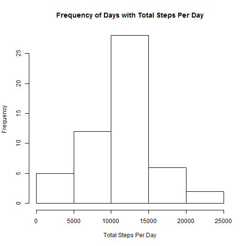
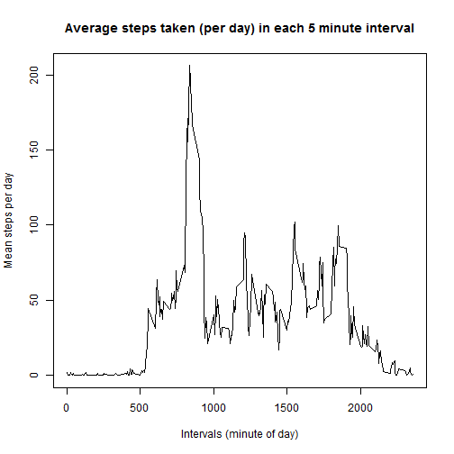
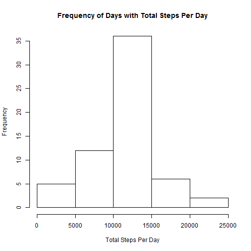
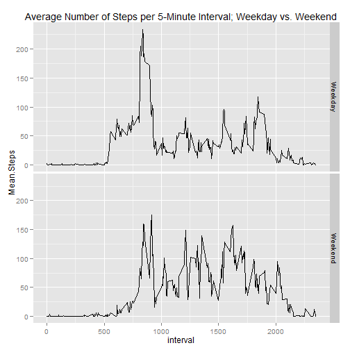

### Loading and preprocessing the data 


```r
#install.packages("plyr")
#install.packages("chron")
#install.packages("ggplot2")
library(plyr)
library(chron)
library(ggplot2)
file <- "http://d396qusza40orc.cloudfront.net/repdata%2Fdata%2Factivity.zip"
download.file(file,"activity.zip")
unzip("activity.zip")
activity <- read.csv("activity.csv")
```

### Histogram of the total number of steps each day


```r
stepsday <-ddply(activity, "date", transform, total=sum(steps))
stepsday <- subset(stepsday, !duplicated(date))
hist(stepsday$total,
    main = "Frequency of Days with Total Steps Per Day",
    xlab = "Total Steps Per Day")
```

 

### What is the mean and total number of steps taken each day?

The instructions say to "ignore missing values in the dataset." I interpreted this as "Calculate the mean with na.rm = True". This choice means that any day with even one value for steps taken in a given 5-minute interval will be counted towards a full day's data. 


```r
options(digits=7)
meansteps <- mean(stepsday$total, na.rm=T)
mediansteps <- median(stepsday$total, na.rm=T)
options(scipen = 999) # Turn off scientific notation so that values printed out aren't in scientific notation.
```

#### The mean steps per day was 10766.1886792. The median steps per day was 10765.
  
  
### What is the average daily activity pattern?

The instructions were to plot (using a time series plot of type = 'l') the number of steps taken in each 5-minute interval averaged across all days (y-axis). I interpreted "averaged across all days" to mean "averaged across all days for which the number of steps in the interval was not NA."


```r
options(scipen = 0) # Turn on scientific notation
intervals = subset(activity, date == "2012-10-01",select = interval)
mean.steps <- tapply(activity$steps, activity$interval, mean, na.rm=T)
meanstepsperinterval <- cbind(intervals,mean.steps)
meanstepsperinterval <- as.data.frame(meanstepsperinterval)
plot(meanstepsperinterval,
     type = 'l',
    main = "Average steps taken (per day) in each 5 minute interval",
    xlab = "Intervals (minute of day)",
    ylab = "Mean steps per day")
```

 

#### Which 5-minute interval, on average across all the days in the dataset, contains the maximum number of steps?


```r
maxinterval <- meanstepsperinterval[which(meanstepsperinterval$mean.steps
                                         == max(meanstepsperinterval$mean.steps)),1]
```
#### The max number of steps occurs within the interval beginning with minute 835. This correlates to 8:35-8:40AM.  

  
### Inputting missing values

Calculate and report the total number of missing values in the dataset (coded as NA).


```r
missing <- sum(is.na(activity[,1]))
```

#### The total number of missing values was 2304.

Devise a strategy for filling in all of the missing values in the dataset.

I chose to replace each NA value for steps with the mean for that 5-minute interval.

Create a new dataset that is equal to the original dataset but with the missing data filled in.


```r
# Create new data frame
newactivity <- activity
# For every row in the new data frame, if the value of steps for that row is NA, we are going to change the value
# of steps to the mean steps for that interval (per day)
for (row in 1:length(newactivity$steps)) {
        if(is.na(newactivity[row,1])) {
                newactivity[row,1] <- meanstepsperinterval[which(meanstepsperinterval$interval == newactivity[row,3]),2]
        }
}
newmissing <-sum(is.na(newactivity[,1]))
```

There are 2304 NA values in the new dataframe, confirming the NA values have all been replaced by data.

Make a histogram of the total number of steps taken each day and calculate and report the mean and median total number of steps taken per day. 


```r
newstepsday <-ddply(newactivity, "date", transform, total=sum(steps))
newstepsday <- subset(newstepsday, !duplicated(date))
hist(newstepsday$total,
    main = "Frequency of Days with Total Steps Per Day",
    xlab = "Total Steps Per Day")
```

 

```r
newmeansteps <- mean(newstepsday$total, na.rm=T)
newmediansteps <- median(newstepsday$total, na.rm=T)
options(scipen = 999) # Turn off scientific notation so that values printed out aren't in scientific notation.
```

#### The new mean steps per day was 10766.1886792. The median steps per day was 10766.1886792.

#### Do these values differ from the estimates from the first part of the assignment? What is the impact of inputing missing data on the estimates of the total daily number of steps?

The data with the NAs replaced by the method above will convert any day with all NA data in the original to a day with perfectly average data. This can be seen in the graph, as the main difference is that the number of cases from 10,000 to 15,000 steps increased by approximately 10. Overall, it will reduce the standard deviation of steps per day without any significant effect on the mean or median.

(As an aside, the result would be different if instead of full days being NA, only handfuls of intervals in given days were NA. In this case, the method would have increased the average and median.)

### Are there differences in activity patterns between weekdays and weekends?

Create a new factor variable in the dataset with two levels -- "Weekday" and "Weekend" indicating whether a given day is
a weekday or weekend

The instructions do not say whether the original (with NA values) or the new dataset (with NA values replaced) should be used for this plot. I chose to use the original data with NA values.


```r
options(scipen = 0) # Turn off scientific notation so that values printed out aren't in scientific notation.
type <- is.weekend(activity$date)
activitydaytype <- cbind(activity,type)
activitydaytype$type = as.character(activitydaytype$type)
activitydaytype$type <- mapvalues(activitydaytype$type, c("TRUE","FALSE"), c("Weekend","Weekday"), warn_missing = TRUE)
activitydaytype$type <- as.factor(activitydaytype$type)
activitydaytype <- ddply(activitydaytype, .(type, interval), summarize, Mean.Steps = (mean(steps, na.rm=T)))

#Mean.Steps <- tapply(activitydaytype[,3:4], activity$interval, mean, na.rm=T)
#activitydaytype <- cbind(activitydaytype,Mean.Steps)

g <- ggplot(activitydaytype, aes(x = interval, y = Mean.Steps))
g <- g + geom_line()
#p <- p + geom_smooth(method = "lm", se=FALSE, color="black", formula = y ~ x)
g <- g + facet_grid(type ~ .)
g <- g + ggtitle("Average Number of Steps per 5-Minute Interval; Weekday vs. Weekend")
print(g)
```

 
